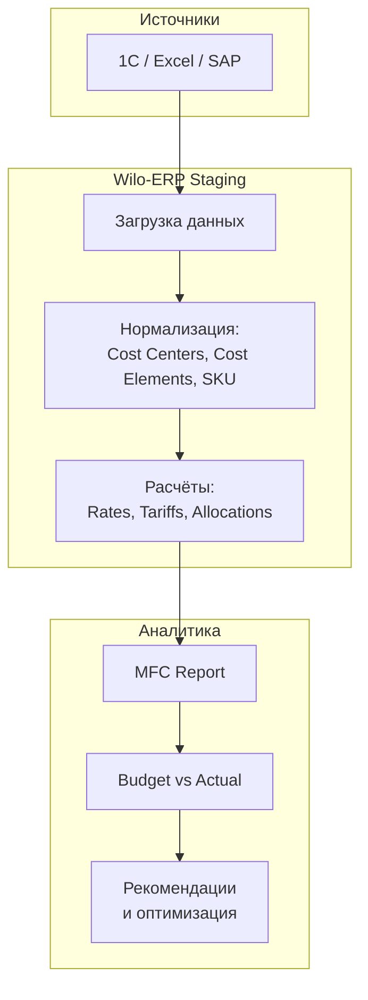

# Контроллинг в Wilo Rus

!!! abstract "Кратко"
    Контроллинг в Wilo Rus является частью департамента финансов и включает два ключевых направления:  
    **финансовый контроллинг** и **производственный контроллинг**.  
    Их совместная задача — обеспечить прозрачность затрат, точность планирования и управляемость финансового результата завода.

---

## 1. Роль и место контроллинга

Контроллинг — это **информационно-аналитическая функция** компании, соединяющая финансовые и производственные данные для поддержки управленческих решений.  
Он не ограничивается бухгалтерским учетом, а обеспечивает **план-факт-анализ**, прогнозирование и разработку предложений по повышению эффективности.

!!! note "Интеграция в структуру"
    Контроллинг подчиняется **финансовому директору (CFO)** и работает в тесном взаимодействии с подразделениями:
    - Производство (Production)
    - Логистика (Logistics)
    - Планирование и снабжение (Planning & Procurement)
    - Бухгалтерия (Accounting)

---

## 2. Финансовый контроллинг

Финансовый контроллинг отвечает за:
- Подготовку **годового бюджета (Budget)** и **прогнозов (Forecast)**.  
- Консолидацию управленческой отчётности для **Wilo Group**.  
- Анализ **план–факт–отклонений** по затратам, доходам и результатам.  
- Мониторинг ключевых **финансовых KPI**: оборот, EBIT, маржинальность, OPEX, Capex.  
- Подготовку пояснительных записок, презентаций и комментариев к результатам.

---

## 3. Производственный контроллинг

Производственный контроллинг обеспечивает связь между **производственными процессами** и **финансовыми результатами**.  
Он отвечает за **учёт, анализ и прогноз затрат** в производственном цикле.

### Основные задачи
- Планирование и анализ **себестоимости продукции (по SKU)**.  
- Контроль затрат по:
  - **центрам затрат (Cost Centers)**,  
  - **видам затрат (Cost Elements)**,  
  - **продукции (Cost by Product)**.  
- Расчёт и анализ **MFC Report** (Material & Factory Cost Report).  
- Подготовка базы для расчёта **тарифов ОПР** (overhead rates) и **ставок затрат**.  
- Анализ отклонений (**Budget vs Actual**) с выделением влияющих факторов:
  - Объём (Volume),
  - Цена (Rate),
  - Микс (Mix).  
- Подготовка рекомендаций по оптимизации затрат.

!!! tip "Инструменты и данные"
    Производственный контроллинг использует как внешние источники данных (1С, SAP, Excel),  
    так и внутреннюю систему **Wilo-ERP**, где выполняются:
    - загрузка и нормализация данных,  
    - расчёты себестоимости и тарифов,  
    - формирование управленческой отчётности.

---

## 4. Цели и задачи контроллинга

| Направление | Цель | Основные результаты |
|--------------|------|--------------------|
| **Бюджетирование (Budget)** | Сформировать достоверный годовой план по затратам и объёмам | Утверждённый бюджет, согласованный с HQ |
| **Прогнозирование (Forecast)** | Обеспечить актуальный прогноз результатов завода | Обновлённые версии F1, F2, F3 |
| **Учёт и отчётность (Actuals)** | Обеспечить точный план-факт-анализ | MFC Report, SKU Cost Report |
| **Анализ отклонений (Variance)** | Определить причины отклонений и зоны оптимизации | Комментарии, предложения по улучшению |
| **Мониторинг KPI** | Контролировать финансовую и производственную эффективность | Dashboard KPI, отчёты руководству |

---

## 5. Архитектура данных контроллинга (в контексте Wilo-ERP)

!!! info "ERP как ядро аналитики"
    Wilo-ERP выступает как единый источник управленческих данных для завода:
    хранит справочники, ставки, фактические и плановые показатели, а также результаты расчётов и отчётности.

---
## 6. Роль контроллера

Контроллер — это партнёр менеджмента, который:
Понимает бизнес-процессы и умеет интерпретировать цифры.
Сочетает аналитическое мышление и операционное понимание производства.
Обеспечивает не только отчётность, но и аналитическую поддержку решений.
Главная цель контроллера — превратить данные в управленческое знание.

---
## 7. Взаимосвязь с другими разделами документации

- [О компании Wilo Rus](company.md)
- [Блок планирования (Budget & Forecast)](../20_process/planning/index.md)
- [Закрытие периода и MFC Report](../20_process/period_close_reporting/index.md)
- [Анализ отклонений](../20_process/variance_analysis/index.md)
- [Архитектура Wilo-ERP](../30_system_wilo_erp/architecture.md)

---

## 8. Ключевые принципы работы

- **Прозрачность данных** — каждый показатель имеет источник и логику расчёта.  
- **Единая методология** — правила расчёта и отчётности согласованы с HQ Wilo.  
- **Регулярность** — цикл планирования и анализа выполняется по календарю:  
  - **Budget** — ежегодно  
  - **Forecast** — ежеквартально  
  - **Actual** — ежемесячно  
- **Фокус на улучшении** — контроллинг не просто фиксирует, а предлагает решения.

---

## 9. Резюме

Контроллинг в **Wilo Rus** — это не только отчётность, но и система управленческого анализа,  
соединяющая стратегию, финансы и производство.  
Его задача — помочь заводу видеть себя *«изнутри цифр»* и принимать решения на основе данных.
