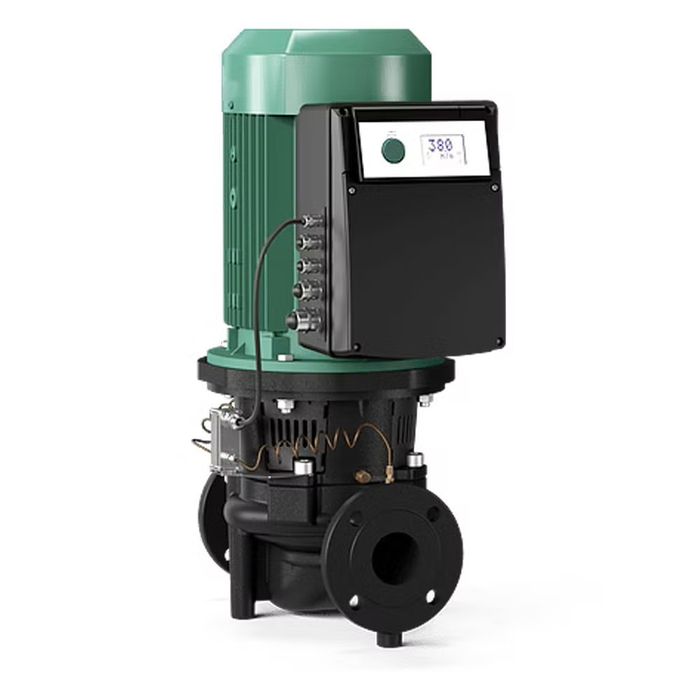
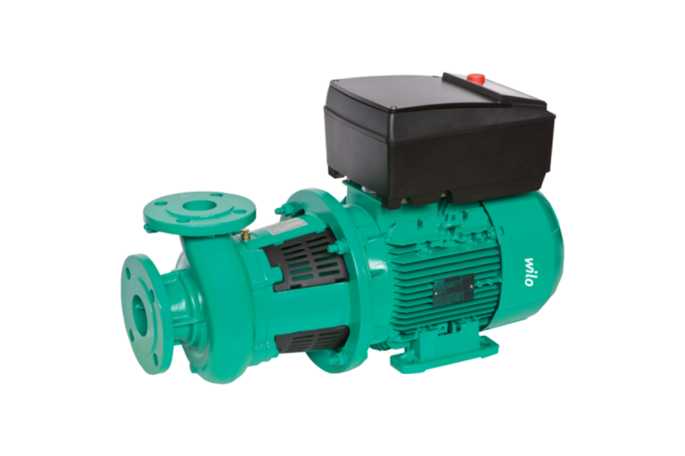
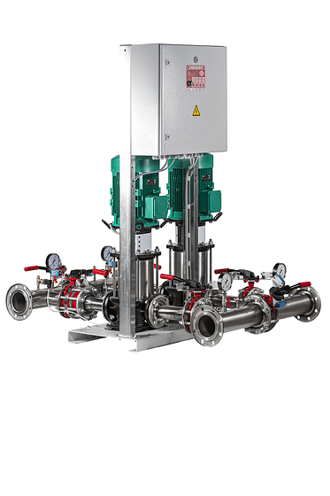
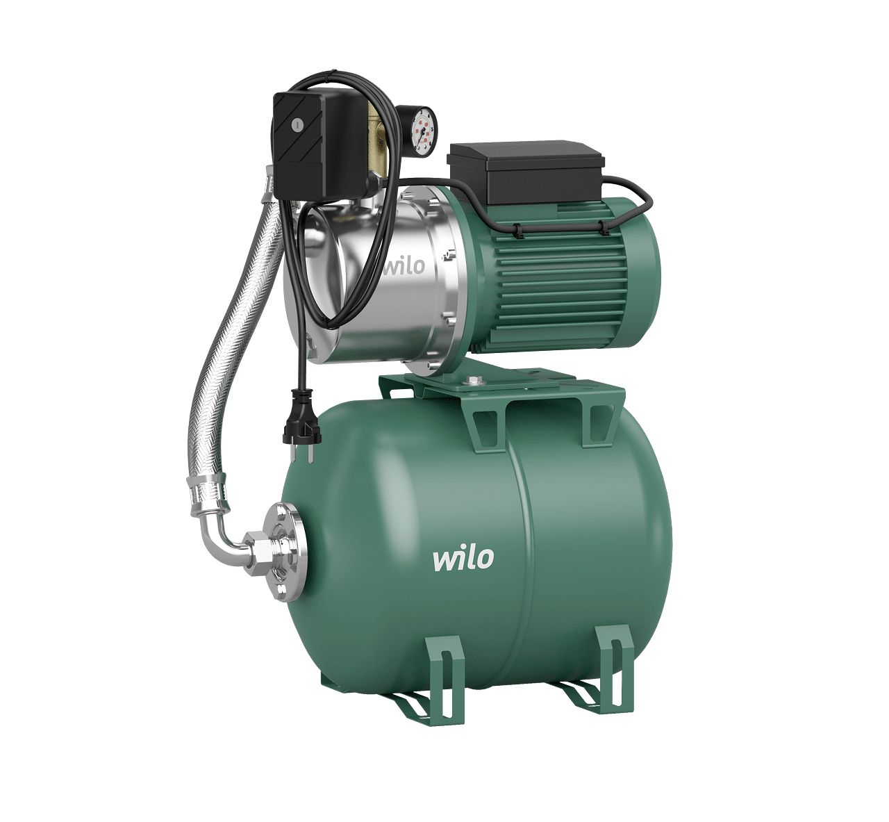

# Производимая продукция

Основной ассортимент предприятия представлен насосным оборудованием и сопутствующими системами, производимыми на заводе Wilo.

---

## 1. Промышленные насосы

- **IL-серия (Inline)**  
  Прямоточные насосы с осевым расположением патрубков. Используются в системах отопления, вентиляции и водоснабжения. Отличаются компактностью и лёгким обслуживанием.
  

- **BL-серия (Block-pump)**  
  Блочные насосы с жёстким соединением двигателя и корпуса. Применяются для перекачивания чистых и слабозагрязнённых жидкостей в инженерных сетях зданий и промышленных объектов.
    

- **IPL-серия**  
  Локализованные версии IL-серии, адаптированные под российские стандарты и местные условия эксплуатации. Производятся с использованием локальных компонентов.

---

## 2. Насосные станции

- **Станции повышения давления**  
  Обеспечивают стабильное давление в системах водоснабжения жилых, административных и промышленных зданий.  
  Могут включать один или несколько насосов, частотное регулирование и шкаф управления.

- **Пожарные насосные станции**  
  Предназначены для систем противопожарного водоснабжения. Оснащаются основным и резервным насосами, пускозащитной автоматикой и системой аварийного оповещения.
   

---

## 3. Шкафы управления

Производятся для автоматизации и защиты насосных установок.  
Функции: управление частотой вращения, защита от перегрузок, сухого хода, аварийных состояний, интеграция с системами диспетчеризации.

---

## 4. Бытовые насосы

- **Насосы для чистой воды** — компактные модели для водоснабжения частных домов, систем полива и циркуляции.  
- **Дренажные насосы** — для отвода сточных, дождевых и грунтовых вод.
   

---

## 5. Связь с ERP-структурой

В базе данных Wilo-ERP каждая позиция продукции хранится в таблице **`items`**,  
а её состав — в дереве спецификаций **`bom`** и маршрутах **`routings`**.  
Детализация стоимости формируется по цепочке:

**`items` → `bom` → `routing_flat` → `cost_rates` → `v_cogs_unit`**

Это обеспечивает прослеживаемость себестоимости от изделия до составляющих компонентов и операций.
