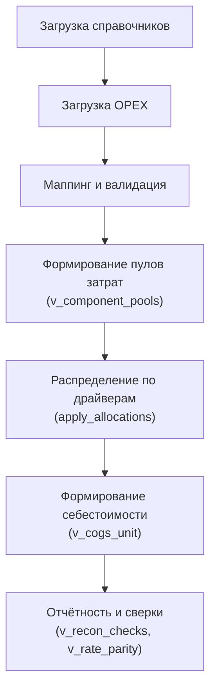

# Принципы учёта в Wilo RUS

> Версия: 2025-10-29  
> На основе базы данных и модулей Wilo-ERP (Python + SQLite + Streamlit)

---

## 1. Общие принципы

Wilo-ERP моделирует корпоративную систему управленческого учёта (SAP CO) в лёгком Python-стеке.  
Цель — прозрачное прослеживание затрат от источников (OPEX, 1С) до себестоимости продукции (COGS) через формальные драйверы и правила.

Все данные классифицируются по двум осям:

| Ось | Сущность | Таблица |
|-----|-----------|----------|
| Организационная | Центр затрат (**Cost Center**) | `cc_nodes` |
| Экономическая | Элемент затрат (**Cost Element**) | `elem_nodes` |

Расходы загружаются в OPEX-бюджет, проходят маппинг и валидацию, после чего участвуют в распределениях (allocations) и формируют себестоимость продукции.

---

## 2. Центры затрат (Cost Centers)

- **Таблицы:** `cc_nodes`, `cc_edges`, `dep_cc_map`  
- **Описание:** иерархия предприятия — завод → цех → участок → станция  
- **Правила:**
  - В расчётах участвуют только *листовые* узлы (`leaf = 1`);
  - Группы используются для агрегации и построения правил распределения;
  - Связи реализованы через `cc_edges(parent_id, child_id)`.

**Типы ЦЗ:**

| Тип | Пример кода | Назначение |
|------|--------------|-------------|
| Производственные | RU1OP1P21 | Основное производство |
| Обслуживающие | RU1LG1… | Логистика, транспорт, склады |
| Административные | RU1AD1… | Управление, офис, вспомогательные службы |

Связь с департаментами 1С обеспечивается через `dep_cc_map`.

---

## 3. Элементы затрат (Cost Elements)

- **Таблицы:** `elem_nodes`, `elem_edges`, `elem_map_rules`  
- **Иерархия:** повторяет структуру MFCPRIM из SAP CO:  
  - `MFC_PRIM_1` — прямой труд (**LABOR_DIRECT**)  
  - `MFC_PRIM_2` — операционные расходы (**OPR_DIRECT**)  
  - `MFC_PRIM_3` — амортизация ОПР (**DEPR_DIRECT**)  
  - `MFC_OVH_LOG` — накладные логистические (**OVH_LOG**)  
  - `MFC_OVH_ADM` — административные (**OVH_ADM**)

**Маппинг:**  
При загрузке OPEX (`opex_staging`) каждая строка классифицируется по правилам (`elem_map_rules`) на основе описания счёта или статьи и получает `mapped_elem_id`.

---

## 4. Справочники и загрузка данных

- **Источники:** Excel-файлы и TXT-выгрузки из 1С;  
- **Парсеры:** устойчивы к кодировкам и «грязным» данным (`loaders.utils.read_1c_txt`, `read_excel`).

**Основные справочники:**
- `items` — номенклатура продукции и материалов;  
- `cc_nodes` — центры затрат;  
- `elem_nodes` — элементы затрат;  
- `ovh_tariffs` — тарифы накладных (A001–A010);  
- `cost_rates` — ставки труда и амортизации.  

**Загрузчики:**  
`load_cc_structure_twofiles`, `load_ovh_tariffs`, `upsert_labor_rates_snapshot`, `stage_opex` → `commit_opex`.

---

## 5. Поток данных учёта

| Этап | Слой | Основные таблицы и функции |
|------|------|------------------------------|
| Загрузка | staging | `opex_staging`, `loaders.opex_loader` |
| Нормализация | budget | `opex_budget`, `elem_map_rules` |
| Пулы затрат | pool | `v_component_pools` |
| Распределения | allocations | `cost_allocations`, `apply_allocations()` |
| Себестоимость | reporting | `v_cogs_unit`, `v_recon_checks` |

---

## 6. Правила расчёта и ответственности

- **Инструмент:** *Allocation Wizard* (`ui.alloc_wizard`):  
  выбор периода, сценария, компонент, ЦЗ, элементов и драйверов;  
  предпросмотр пула и запись правила.

- **Движок:** `calc.alloc_engine.apply_allocations()`  
  формирует строки `cost_allocations` по весам из `driver_values`;  
  поддерживает политики `weights` и `rate`.

**Контроль:**
- `v_recon_checks` — сумма пулов должна равняться сумме аллокаций;  
- `v_rate_parity` — сверка LABOR_DIRECT: пул ≈ Σ (часы × ставка).

---

## 7. Примеры классификации затрат

| Вид затрат | Источник OPEX | Драйвер распределения | Целевая аналитика |
|-------------|----------------|------------------------|-------------------|
| Прямой труд | `MFC_PRIM_1` | Часы (HOURS) | Себестоимость продукции |
| Амортизация ОПР | `MFC_PRIM_3` | Материальные затраты | Себестоимость ОПР |
| Логистика (OVH_LOG) | `A005–A007` | Материальная база | Себестоимость готовой продукции |
| Административные (OVH_ADM) | `A008–A010` | ЗП + ОПР | Общезаводские накладные |

---

## 8. Основные таблицы и вьюхи

| Категория | Таблицы |
|------------|----------|
| **Справочники** | `cc_nodes`, `elem_nodes`, `ovh_tariffs`, `cost_rates` |
| **OPEX-данные** | `opex_staging`, `opex_budget` |
| **Распределения** | `driver_values`, `cost_allocations` |
| **Отчётность и контроль** | `v_component_pools`, `v_cogs_unit`, `v_rate_parity`, `v_recon_checks` |

---

## 9. Итоговые принципы

- Основная аналитика — пара **ЦЗ × Элемент**;  
- Источник истины — `opex_budget` (или `fact_opex`);  
- Распределения выполняются через движок allocations, прямое чтение `unit` запрещено (`settings.no_unit_reads = 1`);  
- Все расчёты параметризуются сценарием и периодом;  
- Прозрачность обеспечивается сквозными вьюхами: `v_component_pools` → `cost_allocations` → `v_cogs_unit`.
## 10. Дополнительные материалы

- [Материальная себестоимость (BOM)](planning/bom.md)
- [Прямые затраты (cost_rates)](planning/direct_costs.md)

