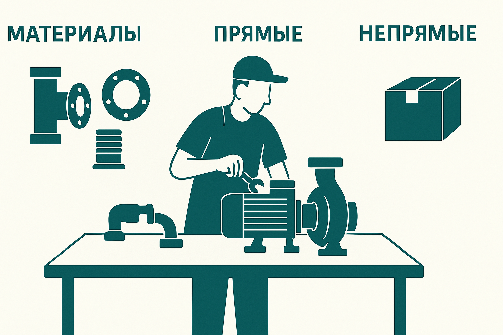

# Структура себестоимости насосной станции

> Версия: 2025-10-29  
> Основано на модели Wilo-ERP (производственная калькуляция, Python + SQLite)

---

## 1. Общая концепция

Себестоимость насосной станции в **Wilo-ERP** строится по трёхуровневой модели затрат:

1. **Материальная себестоимость (Material Cost)**  
2. **Прямые производственные расходы (Direct Manufacturing Cost)**  
3. **Непрямые расходы (Overhead / Indirect Cost)**

Каждый уровень формируется из своих источников данных (BOM, маршруты, OPEX, тарифы) и отражает структуру формирования стоимости изделия — от закупленных компонентов до общезаводских накладных.



---

## 2. Материальная себестоимость

**Источник:** спецификации и закупочные цены (`bom_flat`, `rm_prices`, `mo_prices_history`).

Материальная часть включает:

1. **Материалы и комплектующие** — прямая стоимость всех компонентов из дерева BOM.  
2. **Брак (Scrap)** — рассчитывается по среднему проценту `scrap_share` из `ovh_tariffs`, применяется к материальной базе.  
3. **Услуги переработчика (Tolling Services)** — внешние услуги по обработке материалов, например, окраска, сварка или мехобработка, выполняемые сторонним подрядчиком.  
   - В системе отражаются как материалы с типом `service`;  
   - Цена берётся из `mo_prices_history` или `rm_prices`;  
   - При калькуляции включаются в материальную базу изделия, чтобы корректно учитывать процент брака и базы распределения оверхэдов.  

**Формула:**
```
Material Cost = Σ(BOM.qty × Price) + Scrap + Tolling Services
```

**Таблицы и представления:**
- `bom_flat` — развернутый состав изделия  
- `rm_prices` / `mo_prices_history` — цены материалов и услуг  
- `v_price_by_scenario` — актуальные цены по сценариям  
- `ovh_tariffs(scrap_share)` — доля брака  

---

## 3. Прямые производственные расходы

**Источник:** маршруты (`routing_flat`) и ставки (`cost_rates`, `labor_rates_snapshot`, `depr_rates_snapshot`).

Прямые расходы включают три компонента, рассчитываемые на основе часовой ставки по центрам затрат:

1. **Заработная плата прямого персонала (Direct Labor)**  
   - Часы операций × ставка из `cost_rates(kind='labor')`.  
   - Формируется через `apply_allocations()` по драйверу `HOURS`.

2. **Прочие прямые расходы (Other Direct)**  
   - Также часовые — учитывают вспомогательные затраты, энергию, инструмент, обслуживание.  
   - Отдельная ставка по `cost_rates(kind='other')`.  
   - Применяется к тем же трудовым часам (`HOURS`).

3. **Амортизация производственного оборудования (Depreciation)**  
   - Рассчитывается по часовой ставке `cost_rates(kind='depr')`;  
   - База — часы (`HOURS`) по маршрутам.  

**Формула:**
```
Direct Cost = (Labor + Other + Depreciation) × Hours
```

**Механизм расчёта:**
- `routing_flat` → содержит нормативные часы и операции;  
- `cost_rates` → ставки по видам прямых расходов;  
- `apply_allocations()` → пишет строки в `cost_allocations` по `HOURS`;  
- `v_rate_parity` → сверяет OPEX-пул и сумму «часы × ставка».  

---

## 4. Непрямые расходы (Overhead)

**Источник:** OPEX-бюджет и тарифы накладных (`ovh_tariffs`, `ovh_flat`).

Состав непрямых расходов:

1. **Амортизация ОПР (DEPR_OPR)**  
   - Рассчитывается процентом от материальной базы (`MATCOST`).  
   - Процент хранится в `ovh_tariffs(cost_type='depr_opr')`.  
   - Применяется к каждому производственному ЦЗ, исходя из доли материалов.

2. **Транспортно-заготовительные (LOG Overhead)**  
   - Распределяются по материальной базе (`MATCOST`).  
   - Процент хранится в `ovh_tariffs(cost_type='log')`.

3. **Административные и управленческие (ADM Overhead)**  
   - Распределяются по базе «зарплата + ОПР» (`PAYROLL_OTHER`).  
   - Процент хранится в `ovh_tariffs(cost_type='adm')`.

**Формула:**
```
Overhead = DEPR_OPR + LOG + ADM
```

**Принцип распределения:**
- На уровне завода пулы затрат агрегируются в `v_component_pools`;  
- Драйверы (`MATCOST`, `HOURS`, `PAYROLL_OTHER`) определяют базу;  
- Аллокации формируются в `cost_allocations` и отражаются в `v_cogs_unit`.

---

## 5. Итоговая структура себестоимости насосной станции

| Уровень | Компонент | Источник | Драйвер | Пример базы |
|----------|------------|-----------|-----------|---------------|
| **I. Материальная часть** | Материалы и комплектующие | BOM / rm_prices | — | Цена за ед. × количество |
|  | Брак (Scrap) | ovh_tariffs | Материальная база | % по заводу |
|  | Услуги переработчика | mo_prices_history | — | Стоимость услуги |
| **II. Прямые расходы** | Заработная плата | cost_rates(labor) | Часы | Routing × ставка |
|  | Прочие прямые | cost_rates(other) | Часы | Routing × ставка |
|  | Амортизация | cost_rates(depr) | Часы | Routing × ставка |
| **III. Непрямые расходы** | Амортизация ОПР (DEPR_OPR) | ovh_tariffs | Материальная база | % от MATCOST |
|  | Логистика (LOG) | ovh_tariffs | Материальная база | % от MATCOST |
|  | Админ / управленческие (ADM) | ovh_tariffs | ЗП + ОПР | % от PAYROLL_OTHER |

---

## 6. Финальная калькуляция (v_cogs_unit)

Вся структура собирается в представлении `v_cogs_unit`, где строки отражают компоненты себестоимости, а суммы формируются из `cost_allocations`.  
Это обеспечивает полную трассировку:  
**OPEX → Пулы затрат → Распределения → Себестоимость изделия.**

**Формула итоговой себестоимости:**
```
Total Cost = Material + Direct + Overhead
```
