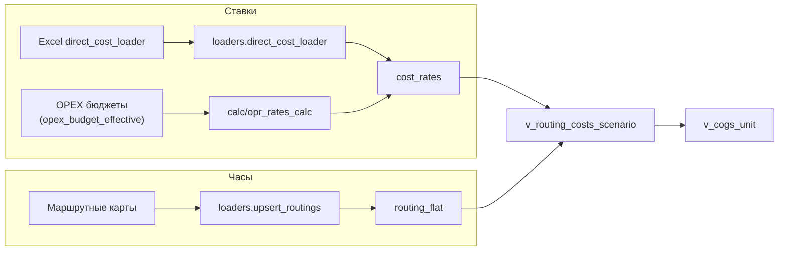

# Прямые затраты: ставки и часы

Прямые затраты попадают в себестоимость напрямую на конкретный продукт и центр затрат производственного подразделения. На текущий момент используются три компонента `component_code`:
- `LABOR_DIRECT` - заработная плата прямого персонала (стоимость часа труда).
- `OPR_DIRECT` - прочие прямые расходы на персонал (премии, доплаты, страховые).
- `DEPR_DIRECT` - амортизация производственных линий, рассчитанная на час работы.

Чтобы получить стоимость операции, нужны две группы данных:
1. **Ставки** (`cost_rates.rate_value`) в разрезе года/сценария, департамента и центра затрат.
2. **Часы** (`routing_flat.hours_per_unit`) по маршрутам выпуска с детализацией до операции.

Ниже приведена цепочка формирования ставок и часов с указанием интерфейсов, модулей, таблиц и используемых полей.

## Входные данные

### 1. Excel-файл для загрузчика direct_cost_loader
Интерфейс Streamlit (`ui.views_upload.render_direct_cost_loader`) принимает широкий Excel и нормализует его в длинную форму. Минимальный набор колонок:

| Колонка | Назначение | Попадает в |
|---|---|---|
| `CostCenter`, `CC`, `cc_id` | Центр затрат | `cost_rates.cc_id` |
| `WorkCenter`, `Department` | Код цеха/участка | `cost_rates.department_code` (через `ColumnMap.dept_col`) |
| Месячные столбцы (`2026-01`, `2026-02` ...) | Ставки за месяц | `cost_rates.period_or_year` (YYYY-MM) |
| Годовой столбец (`Tariff`, `Yearly`, `Rate`) | Среднегодовая ставка | `cost_rates.period_or_year` (YYYY) |
| `Scenario` *(опция)* | Название сценария | `cost_rates.scenario` |
| `Currency`, `Unit` *(UI поля)* | Валюта и единица измерения | `cost_rates.currency`, `cost_rates.unit` |

### 2. OPEX-бюджет (альтернативный источник ставок)
Ставки можно рассчитать автоматически на основе бюджетов:
- `opex_budget`, `opex_budget_effective` - суммы по элементам расходов, сгруппированные по `cc_id` и `elem_id`.
- `dep_cc_map` - соответствие производственных департаментов (`department_code`) и центров затрат (`cc_id`).
- `prod_budget` - плановые объёмы производства по сценариям, нужны для распределения часов.
- Справочники групп элементов (набор для прямых расходов) хранятся в `cost_rate_components` и сопутствующих таблицах.

### 3. Маршрутные карты и часы по операциям
- Excel-файл маршрутов (`loaders.upsert_routings`) содержит столбцы `Технологический процесс`, `Вид работ`, `Количество` (часы), `Ресурсная спецификация.Код`, `Номенклатура.Код` и опциональные департаменты.
- Таблицы: `routings`, `routing_operations` с полями `operation`, `department`, `hours`.
- После материализации (см. ниже) формируется `routing_flat` с `product_id`, `department_code`, `hours_per_unit`.

## Загрузка ставок из Excel

| Шаг | Модуль / функция | Результат |
|---|---|---|
| Чтение файла | `loaders.direct_cost_loader._read_xlsx` | Загружает лист и нормализует заголовки |
| Определение колонок | `_detect_columns` | Находит поля CC, департамент, месяцы, годовой тариф |
| Нормализация | `_normalize_long` | Преобразует таблицу в длинную форму с полями `period_or_year`, `scenario`, `component_code`, `department_code`, `cc_id`, `rate_value`, `unit`, `currency`, `source` |
| Запись в БД | `_upsert_cost_rates` | Через временную таблицу `tmp_cost_rates_load` выполняет `INSERT OR REPLACE` в `cost_rates`, заполняя `run_id`, `loaded_at` |
| Интерфейс | `ui.views_upload.render_direct_cost_loader` | Позволяет выбрать компонент (`LABOR_DIRECT` / `OPR_DIRECT` / `DEPR_DIRECT`), валюту и единицу измерения, показать диагностику | 

Таблица `cost_rates` после миграций содержит ключевой набор полей:
`period_or_year`, `scenario`, `component_code`, `department_code`, `cc_id`, `product_id`, `rate_value`, `unit`, `currency`, `source`, `run_id`, `loaded_at`.
Первичный ключ: `(period_or_year, scenario, component_code, department_code, cc_id, product_id)`.

## Расчёт ставок из OPEX-бюджета

Скрипты в `calc/opr_rates_calc.py` позволяют построить ставки автоматически.

| Шаг | Модуль / SQL | Описание |
|---|---|---|
| Определение компонентов | `DEFAULT_RATE_COMPONENTS` / `list_rate_components` | Список активных компонент прямых затрат |
| Часы | `sql/opr_rates_calc/select_hours_by_department.sql` | Вычисляет `hours_year` = Σ(плановый объём × `routing_flat.hours_per_unit`) по `prod_budget` и `routing_flat`, фильтруя по сценарию и месяцам |
| Суммы OPEX | `sql/opr_rates_calc/select_amounts_by_cc_for_elemgroup.sql` | Выбирает суммы по `opex_budget_effective` для нужных центров и элементов расходов |
| Сведение | `calc/opr_rates_calc.calculate_tariff_summary` (и связанные функции) | Строит DataFrame c суммами и часами, рассчитывает ставку `amount_total / hours_year` |
| Запись ставок | `calc/opr_rates_calc.save_rates_cost_rates` + `sql/opr_rates_calc/upsert_cost_rates.sql` | Записывает рассчитанные ставки в `cost_rates` с признаком источника (`source = 'opr_calc'`, `run_id = uuid`) |

Дополнительно модуль поддерживает сравнение с историческими ставками (`_load_rates_from_cost_rates`) и сценарии «что если» (выбор диапазона месяцев, фильтрация групп элементов).

## Получение часов из маршрутов

| Шаг | Модуль / таблица | Детали |
|---|---|---|
| Загрузка маршрутов | `loaders.upsert_routings` (часть `loaders.loaders`) | Записывает операции в `routing_operations`, автоматически определяет департамент по тексту операции (`DEPT_RULES`) |
| Плоский routing | `calc.materialize_sql.materialize_routing_flat` (или `calc.routing_flat.materialize_routing_flat`) | Скрипты `sql/materialize/routing_tree_build.sql` и `routing_flat_build.sql` создают `routing_flat` с полями `product_id`, `node_product_id`, `department_code`, `hours_per_unit`, `operation_id`, `routing_group` |
| Контроль департаментов | `loaders.loaders.diagnose_routings`, `ui.views_quality` | Помогают выявить операции без департамента или с нулевыми часами |
| Связка с центрами затрат | `dep_cc_map` | При загрузке ставок и при расчётах используется для маппинга `department_code -> cc_id` |

Часы на единицу продукции (`routing_flat.hours_per_unit`) умножаются на фактические ставки во время расчётов. Если маршрут обновлён, необходимо заново материализовать `routing_flat` перед пересчётом ставок или запуском калькуляций.

## Витрины и использование

| Артефакт | Заполняется | Содержимое | Где используется |
|---|---|---|---|
| `cost_rates` | Либо `direct_cost_loader`, либо `calc/opr_rates_calc.save_rates_cost_rates` | Ставки по годам/месяцам, сценариям и компонентам | Служит источником для `v_routing_costs_scenario`, `calc.cost_tree.fetch_direct_cost`, бюджетных отчётов |
| `routing_flat` | `materialize_routing_flat` | Часы по операциям на единицу продукта | Используется при расчёте часов (`select_hours_by_department.sql`) и в `v_routing_costs_scenario` |
| `v_routing_costs_scenario` | `db.schema.ensure_scenario_cost_views` | Стоимость операции = `hours_per_unit × rate_value` по выбранному сценарию и году | Источник для `calc.cost_tree.fetch_direct_cost_by_scenario`, `calc.budget.unit_cost_breakdown_v2`, UI cost tree |
| `v_cogs_unit` | Там же | Объединяет материалы, прямые ставки и накладные расходы | Финальная витрина для планирования, variance-анализов и MFC Report |

## Интерфейсы и автоматизация
- **UI**: `ui.views_upload` содержит вкладку «Ставки прямых затрат», позволяющую загружать Excel, диагностировать данные и публиковать их в `cost_rates`.
- **CLI / автоматизация**: модули `calc/opr_rates_calc.py`, `sql/opr_rates_calc/*` и вспомогательные скрипты можно запускать из пайплайна (например, `python -m calc.opr_rates_calc ...`) для расчёта ставок на основе утверждённых бюджетов.
- **Контроль качества**: `loaders.direct_cost_loader._validate` проверяет данные на пропущенные центры затрат, пустые тарифы и дубликаты; `calc.cost_tree.audit_schema_and_data` сообщает о пробелах в `cost_rates` и отсутствующих индексах.

## Итоговая последовательность

Полученные ставки и часы обеспечивают корректный расчёт прямых затрат в бюджете, калькуляциях и отчётности, а также позволяют оперативно анализировать их чувствительность к изменениям ставок или маршрутов. 
