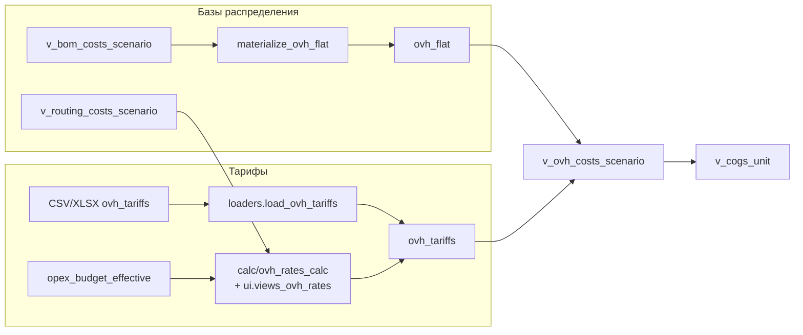

# Непрямые затраты (overhead)

Непрямые затраты включают три компонента, относимых на продукт через группы накладных расходов (`overhead_group`):
- **`depr_opr`** — амортизация и содержание производственных площадок (общепроизводственные расходы).
- **`log`** — логистические расходы (склады, перемещения сырья и продукции).
- **`adm`** — административные расходы (офисы, управленческие функции).

Расчёт выполняется по формуле **`стоимость = база × тариф`**, где:
- **база** — материальная себестоимость или прямые трудовые расходы, рассчитанные на единицу продукции и умноженные на объёмы;
- **тариф** — доля распределения для каждой группы накладных расходов, загружаемая из внешних файлов или рассчитываемая из бюджета OPEX.

Ниже приведён полный поток данных: от исходных таблиц до итоговой витрины `v_ovh_costs_scenario`, которую используют калькуляторы и отчётность.

## Входные данные

| Источник | Что содержит | Ключевые поля | Где используется |
|---|---|---|---|
| `opex_budget`, `opex_budget_effective` | Суммы плановых OPEX по центрам затрат и элементам | `bud_year`, `cc_id`, `elem_id`, `amount_effective` | расчёт тарифов через `calc.ovh_rates_calc.fetch_cost_pools` |
| `ovh_tariffs` | Доли распределения по видам затрат | `overhead_group`, `year`, `cost_type`, `share` | умножение баз в `v_ovh_costs_scenario` |
| `items` | Привязка продукта к накладной группе | `item_id`, `ovh_group_code` | связь баз с тарифами |
| `prod_budget` / `v_prod_budget_active` | Объёмы выпуска по продуктам и сценариям | `product_id`, `month_code`, `scenario`, `qty` | вычисление годовой базы (материалов и прямых) |
| `v_bom_costs_scenario` | Материальная себестоимость на SKU | `product_id`, `scenario_code`, `cost_component` | база для логистики и амортизации |
| `v_routing_costs_scenario` | Прямые трудовые и прочие затраты | `product_id`, `component_code`, `cost_component` | база для административных расходов |

Дополнительно задействованы справочники структур (`cc_nodes`, `cc_edges`, `elem_nodes`, `elem_edges`) и соответствия `dep_cc_map` для агрегации сумм по группам.

## Получение тарифов

### Загрузка из CSV/XLSX
- **Интерфейс / модуль:** `loaders.loaders.load_ovh_tariffs` (доступен через утилиты или Streamlit).
- **Ожидаемый формат:** либо одна строка на группу с колонками `overhead_group`, `scrap_share`, `depr_opr_share`, `log_share`, `adm_share`; либо матрица A001..A010 × `{scrap|depr_opr|log|adm}`.
- **Результат:** заполнение таблицы `ovh_tariffs` (поля `overhead_group`, `year`, `cost_type`, `share`) с `ON CONFLICT`-обновлением.
- **Валидация:** обработка процентов и долей (`share > 1` трактуется как значение в процентах).

### Расчёт на основе OPEX-бюджета

Модуль `calc/ovh_rates_calc.py` поддерживает автоматический расчёт тарифов по выбранным сценариям.

| Шаг | Функции / SQL | Что происходит |
|---|---|---|
| Определение параметров | `TariffParams.resolve` | Берёт год и активные сценарии из `active_scenarios` (через `v_prod_budget_active`) |
| Материальная база | `fetch_material_base` + SQL `material_base_by_group*.sql` | Умножает годовые объёмы (`prod_budget`) на материал `v_bom_costs_scenario`, агрегирует по `items.ovh_group_code` |
| База прямых затрат | `fetch_admin_base` + SQL `admin_base_by_group*.sql` | Использует `v_routing_costs_scenario` (компоненты `LABOR_DIRECT`, `OPR_DIRECT`) и объёмы, формируя `labor_cost`, `other_cost`, `admin_base` |
| Стоимостные пулы | `fetch_cost_pools` | Тянет суммы из `opex_budget_effective` по набору центров затрат: отдельные группы для `depr_opr`, `log`, `adm` |
| Распределение | `calculate_tariff_summary`, `build_cost_distributions` | Сопоставляет пулы с базами, рассчитывает долю `share_raw` и рекомендуемую `recommended_share` |
| Сохранение | `save_tariffs` (вызывает `sql/ovh_rates_calc/upsert_cost_rates.sql`) | Записывает рассчитанные доли в `ovh_tariffs`, добавляя `run_id` и пометку источника |
| Управление скрапом | `write_scrap_tariffs` | Обновляет `cost_type = 'scrap'` для указанных групп, если плановые потери задаются в процентах |

**UI:** `ui.views_ovh_rates.render_ovh_rates_calc` — интерактивная форма Streamlit с предварительным просмотром (`preview_tariffs`), табами по каждому типу затрат и кнопками сохранения. Поддерживает выбор сценариев (`list_volume_scenarios`, `list_price_scenarios`, `list_routing_scenarios`) и ручную корректировку доли скрапа.

## Формирование баз распределения

### Материальная база (`ovh_flat`)

| Шаг | Модуль / SQL | Результат |
|---|---|---|
| Построение дерева | `sql/materialize/ovh_tree_build.sql` | Нормализует иерархию накладных групп (`ovh_nodes`) |
| Раскрытие BOM | `calc.materialize.materialize_ovh_flat` | Использует `v_bom_costs_scenario`, `items`, `prod_budget` и цены по сценарию для расчёта `driver_value_per_unit` (стоимость материала на единицу) |
| Итоговая таблица | `ovh_flat` | Поля: `product_id`, `overhead_group`, `driver_code`, `driver_value_per_unit`, `year`, `source` |
| Совместимая вьюха | `v_ovh_flat_compat` | Предоставляет старый формат (материальная база, мат_cost) для отчётов |

### Прямые трудовые базы

`fetch_admin_base` опирается на витрину `v_routing_costs_scenario`, которая перемножает часы (`routing_flat.hours_per_unit`) и ставки (`cost_rates.rate_value`). Для актуальности базы необходимо:
- материализовать `routing_flat` (`calc.materialize_sql.materialize_routing_flat`) после изменений маршрутов;
- обновить `cost_rates` через `direct_cost_loader` или `calc/opr_rates_calc`;
- при расчёте указать актуальный сценарий маршрутов (`routing_scenario`).  
В результате получаем суммы `labor_cost` и `other_cost` по группе, которые образуют административную базу (`admin_base = labor_cost + other_cost`).

## Витрина `v_ovh_costs_scenario`

Когда базы и тарифы готовы, представление в `db/schema.py` формирует компоненты непрямых затрат:

```sql
SELECT
  f.product_id,
  f.node_product_id,
  f.overhead_group,
  f.driver_code,
  f.driver_value_per_unit,
  t.cost_type,
  t.share,
  t.year,
  f.driver_value_per_unit * t.share AS cost_component
FROM ovh_flat f
JOIN ovh_tariffs t
  ON t.overhead_group = f.overhead_group
WHERE t.year = cfg.year;
```

- **Вход:** `ovh_flat` (база) и `ovh_tariffs` (доли). Активный год берётся из `active_scenarios` (`cfg.year`).  
- **Выход:** строки `product_id × cost_type` с полем `cost_component`, готовые к агрегации.
- **Потребители:**
  - `calc.cost_tree.fetch_indirect_costs_by_scenario` — для UI калькуляторов и аналитики;
  - `calc.budget.build_budget_frames` — формирование бюджетных отчётов;
  - `v_cogs_unit` — финальная себестоимость, где overhead-компоненты объединяются с материалами и прямыми затратами.

## Интерфейсы и контроль

- **UI**: вкладка «Ставки непрямых затрат» (`ui.views_ovh_rates`) позволяет моделировать тарифы, сравнивать распределения и записывать результат в `ovh_tariffs`.
- **CLI / автоматизация**: сценарии на базе `calc.ovh_rates_calc` можно запускать из пайплайна (например, `python -m calc.ovh_rates_calc --year 2026 --vol-scn BG26_VOL`), чтобы пересчитать тарифы после обновления OPEX или маршрутов.
- **Качество данных**: `materialize_ovh_flat` выполняет проверки (пропущенные группы, остатки в `ovh_tariffs`), а `preview_tariffs` выводит распределения и средние доли для сравнения с пулом.
- **Связанные процессы**: при изменении `prod_budget`, `cost_rates`, `v_bom_costs_scenario` или тарифов OPEX необходимо заново прогонять материализацию и расчёт, чтобы `v_ovh_costs_scenario` отражала актуальные значения.

## Итоговая последовательность



Полученная витрина обеспечивает корректное включение амортизационных, логистических и административных расходов в себестоимость, позволяет анализировать доли распределения и быстро пересчитывать overhead после изменений в бюджетах или структуре выпуска. 
