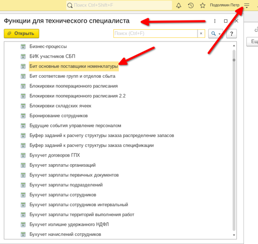
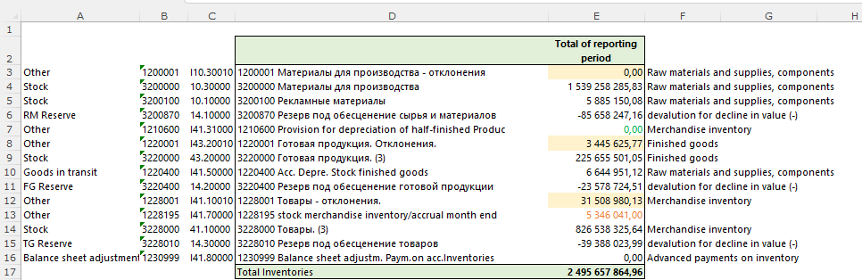

# 1. Выгрузка данных из 1С

Получаем исходные данные из 1С для подготовки листа 6-Inventories.

## Ведомость по товарам на складах

1. Откройте отчёт:
   - прямая ссылка: [e1cib/data/Справочник.ВариантыОтчетов?ref=9ae03cecefab7e6c11eecbcc9dc71f34](e1cib/data/Справочник.ВариантыОтчетов?ref=9ae03cecefab7e6c11eecbcc9dc71f34),
   - либо через интерфейс: «Склад» → «Отчёты по складу» → «Ведомость по товарам на складах».
2. Установите отборы и поля, как на скриншоте, и сформируйте отчёт.

3. Сохраните отчёт в Excel: «Файл» → «Сохранить как» → «Excel». Пример выгруженного файла:

## Поставщики по номенклатуре

1. Откройте меню «Функции технического специалиста» и запустите отчёт «Поставщики для номенклатуры».

2. Нажмите «Вывести список», чтобы получить таблицу с поставщиками.

3. Согласитесь с предложенными настройками вывода списка.

4. Укажите путь и формат сохранения файла (Excel), затем сохраните.

5. Проверьте, что файл сохранился корректно. Пример результата:

## Баланс (сверка запасов)

1. Откройте баланс:
   - прямая ссылка: [e1cib/data/Справочник.ВариантыОтчетов?ref=868e3cecefab7e6c11eed08d250b1706](e1cib/data/Справочник.ВариантыОтчетов?ref=868e3cecefab7e6c11eed08d250b1706),
   - либо через меню, как на скриншоте:

2. Сформируйте баланс и выгрузите его в Excel. Для сверки запасов используйте счета, отмеченные на примере файла:

