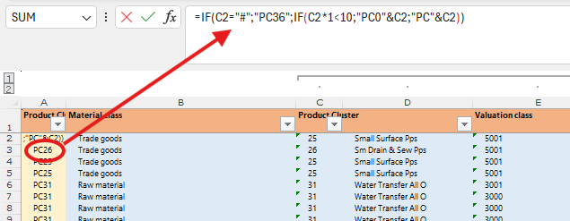

# 2.1. Заполнение листа BW

Лист BW собирает исходные данные для дальнейшей консолидации в 6-Inventories.

## Общий вид листа

## Шаги заполнения

1. Вставьте данные из файла `20 WRU Stock` в блок 1 (первые колонки). Проверьте порядок полей: колонки `Stock Value (RUB)` и `Stock Qty` расположены в обратном порядке относительно выгрузки — подставляйте их в нужные столбцы листа BW.
2. Блок 2 заполняется формулой определения Product Cluster:

3. Блок 3 — формула, подтягивающая поставщика с листа `Materials`:

4. После вставки данных примените фильтр по столбцу `L - Code` и выберите строки с `#N/A` — это материалы без указанных поставщиков. Их заполним на следующем шаге.
