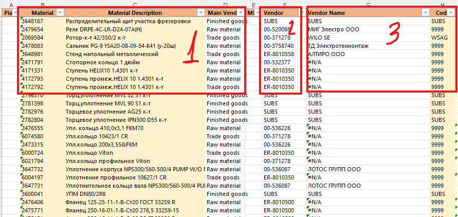
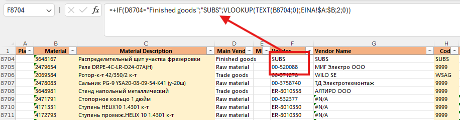

# 2.2. Внесение данных о поставщиках

Лист для обогащения запасов данными о поставщиках состоит из трёх блоков.

## Блоки листа

1. **Материалы из BW:** скопируйте сюда строки из листа BW, где в колонке поставщика стоит `#N/A`.
2. **Номер поставщика:** если материал производится самостоятельно, укажите `SUBS`. Иначе возьмите номер из листа `EINA` — заполните его для новых материалов по выгрузке поставщиков.

3. **Имя и код поставщика:** подтягиваются с листа `Vendor Code`; добавьте новых поставщиков из выгрузки, если их ещё нет.

Примечание: с 2022 года поставок от компаний группы Wilo нет, поэтому любой внешний поставщик должен иметь номер `9999` — заполните его для поставщиков, которых нет в 1С.

### Справочно

1. Лист `EINA` (каталог кодов поставщиков):

2. Лист `Vendor Code`:

