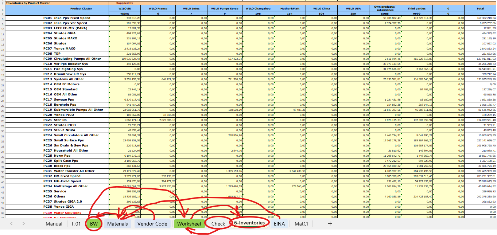

# 2. Обработка данных

Этот раздел описывает общую логику обработки выгрузок для 6-Inventories: сведение данных в рабочий лист, применение классификаций и подготовку к проверкам.

## Перед началом: формируем 20 WRU Stock

- Возьмите выгрузку из 1С (шаг 1 из предыдущего раздела) и добавьте к ней мастер-данные (шаг 2).
- Результат сохраняем как файл `20 WRU Stock`. На скриншоте показан нужный состав данных:

После этого файл `30 Inventories 2025_11.xlsx` получает готовый лист BW.

## Общий поток данных

1. Из файла `20 WRU Stock` копируем данные на лист BW (1), добавляем данные по поставщикам (3) и рассчитываем Product Cluster по формуле (2).

2. С листа BW данные консолидируются с балансом на листе Worksheet.
3. Worksheet переносится на лист 6-Inventories, откуда данные уходят в групповую отчётность.

Детальные шаги разбиты на подпункты:
- 2.1. Заполнение листа BW
- 2.2. Внесение данных о поставщиках
- 2.3. Данные баланса
