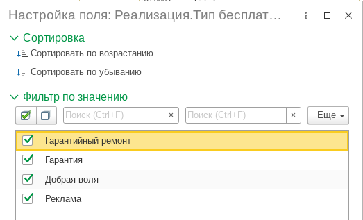
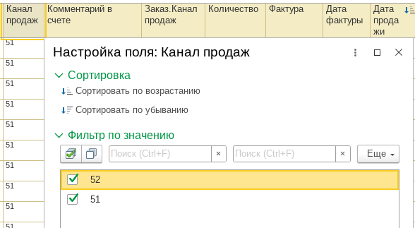
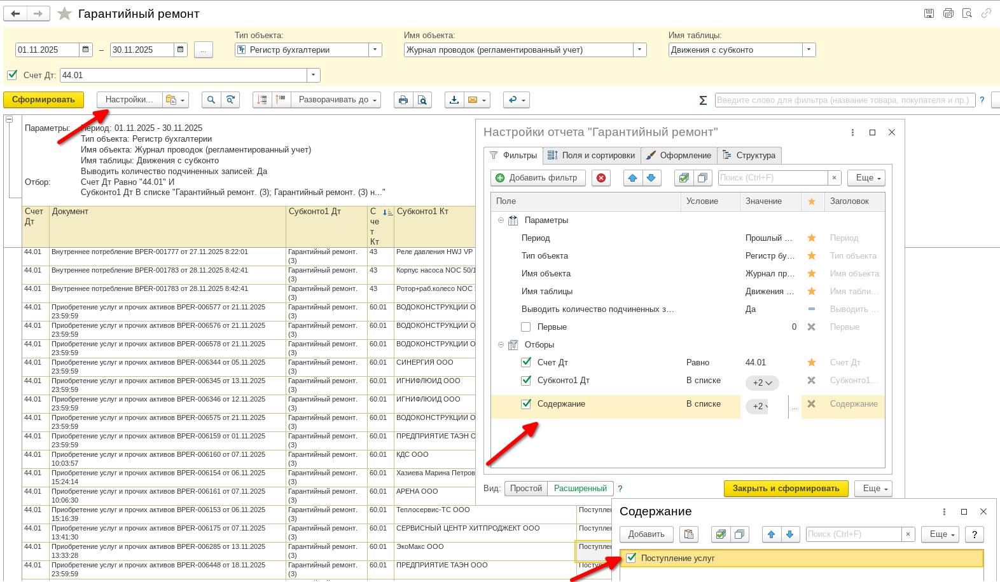

# Выгрузка отчета KE30 из 1С:ERP

## Где открыть

- Прямая ссылка на вариант отчета: `e1cib/data/Справочник.ВариантыОтчетов?ref=87b03cecefab7e6c11f04067cbe56a7c`.
- Меню навигации: Главное меню -> Продажи -> Отчеты по продажам -> KE30 (новый).
- Внешний вид варианта: .

## Настройка полей

- Выберите поля из набора: .
- Ключевые поля:
  1. Тип бесплатного заказа - разделяет затраты на гарантию и добрую волю 
   
  
  2. Канал продаж - показывает 51 (обычная продажа) и 52 (продажа департаментом сервиса) 
  

- Убедитесь, что выгрузка содержит все аналитики, используемые на вкладках KE30, Warranty/Goodwill, ZZGA, 52 Channel, KSB1.

## Отчет по затратам сервисных партнеров

- Прямая ссылка: `e1cib/data/Справочник.ВариантыОтчетов?ref=9a563cecefab7e6c11ef0d047b068ee8`.
- Используйте универсальный отчет с настройками, показанными на скриншоте: .
- Выгрузите данные с тем же периодом, что и основной KE30, чтобы обеспечить сопоставимость по сервисным затратам.
