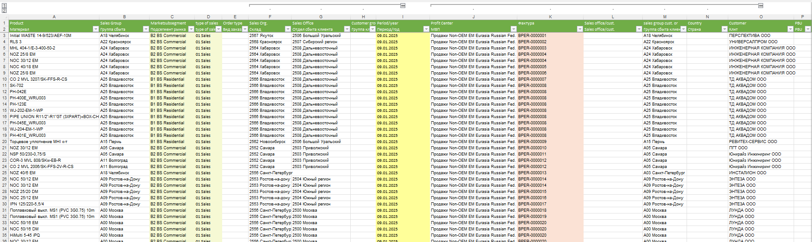
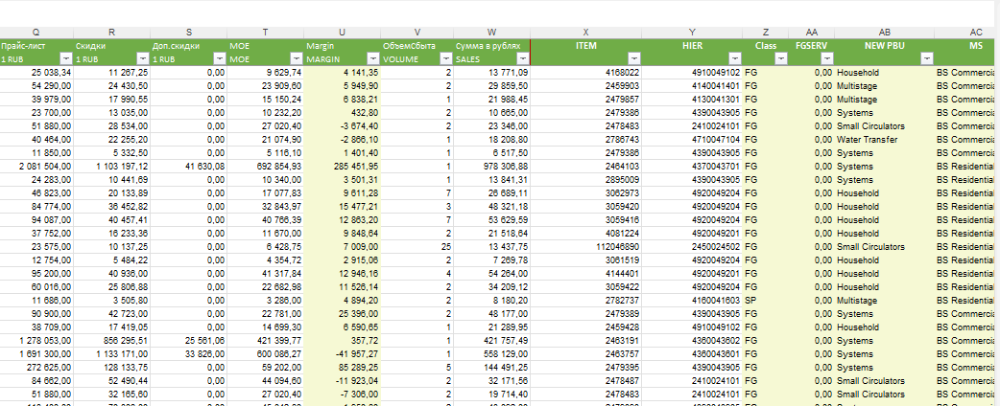
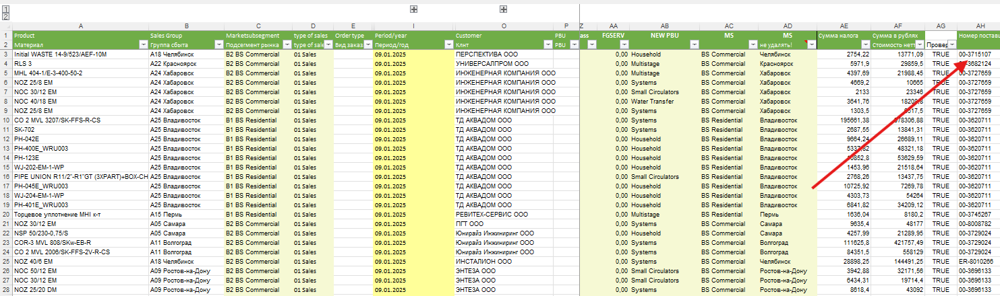
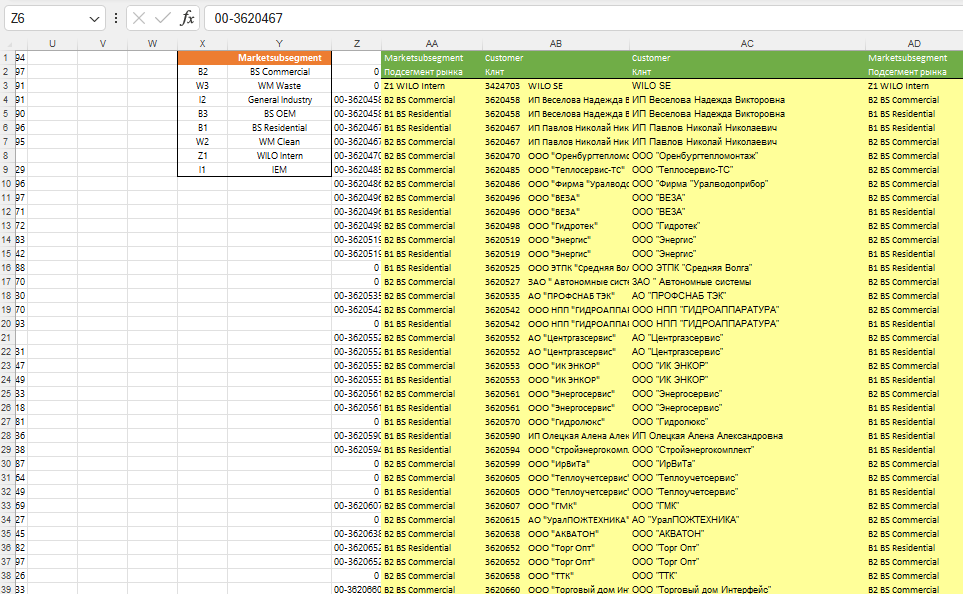

# 1. KE30 - продажи за период

## Перенос данных из KE30 на лист "1. KE30"

- Перенесите все данные за выбранный период из выгрузки KE30 на лист **1. KE30** (шаблон: ).
- Обращайте внимание на расчетные поля и поля ручного ввода, выделенные цветом на шаблоне (пример: ).
- При внесении данных по скидкам агрегируйте их по требуемым разрезам (пример настройки/агрегации: ).
- Обязательно заполните поле **Номер поставщика** - сегмент рынка определяется именно по этому номеру.
- Преобразуйте **Номер материала** и **Продуктовую иерархию** в числовой формат перед загрузкой.

## Доработка мастер-данных

После переноса данных отфильтруйте таблицу KE30 по полю **Product Hierarchy** и значению `#NA` и заполните отсутствующий справочник на листе **Hierarchy**:

1. **Product Hierarchy** - данные есть в выгрузке KE30, направьте на согласование в департамент сервиса (контакт: Вертолетский Дмитрий). Схема/пример: .

Теперь отфильтруйте таблицу KE30 по полю **Marketsubsegment** и значению `#NA` и заполните отсутствующий справочник на листе **Table**:
2. **Marketsubsegment (Подсегмент рынка)** - часто отсутствует; запросите у Макарова Максима отнесение клиента к сегменту. Пример поля: .
