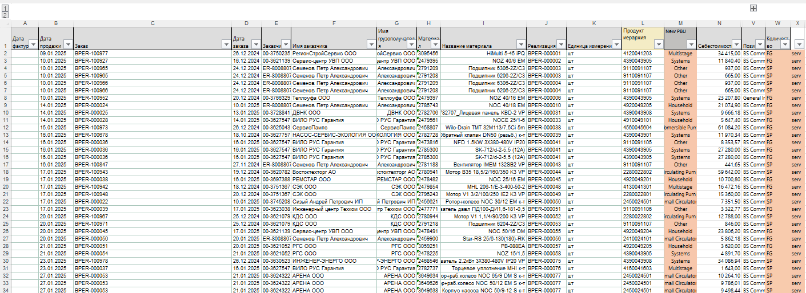
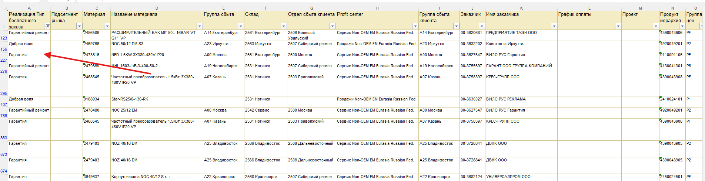

# 2. Warranty / Goodwill

## Лист "2. Warranty"

- Рабочий лист: .
- Источник данных - выгрузка KE30. Установите фильтр `Реализация.Тип бесплатного заказа`:
  - Шаг 1: `Гарантия + Гарантийный ремонт`.
  - Шаг 2: `Добрая воля`.
  - Подсказка по фильтру: .
- Перенос делаем в два этапа, потому что в столбце X нужно вручную проставить:
  - `serv` для строк `Гарантия + Гарантийный ремонт`.
  - `goodw` для строк `Добрая воля`.

## Затраты сервисных партнеров

- Добавьте затраты на услуги из отчета сервисных партнеров (используйте ранее выгруженный файл). Настройки/пример: .
- В столбце M вручную укажите тип `Services`.

## Контроль свода

- После загрузки данных убедитесь, что на листе `57-Service Business` блоки **COS warrenties** и **COS goodwill** заполнены корректно.
- В строке 31 сводного листа значения должны быть `0` (равенство сумм по PBU и MarketSubSegment). Пример контроля: .
