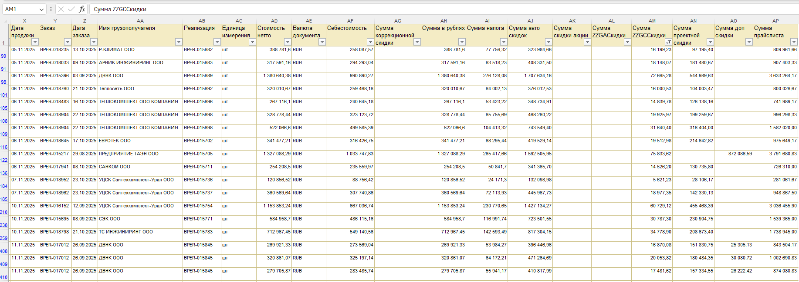

# 3. ZZGA - сервисные надбавки

## Отбор данных в KE30

- В выгрузке KE30 последовательно отфильтруйте колонки **AL - Сумма ZZGAСкидки** и **AM - Сумма ZZGCСкидки**. Подсказка: .
- Скопируйте отфильтрованные данные на лист **3. ZZGA** (шаблон: ).

## Проверка формул

- Проверьте поля с формулами на листе 3. ZZGA и убедитесь, что нет значений `#NA`.
- Если появляются `#NA`, проверьте сопоставление PBU, MarketSubSegment и другие справочные поля, чтобы восстановить соответствия.
