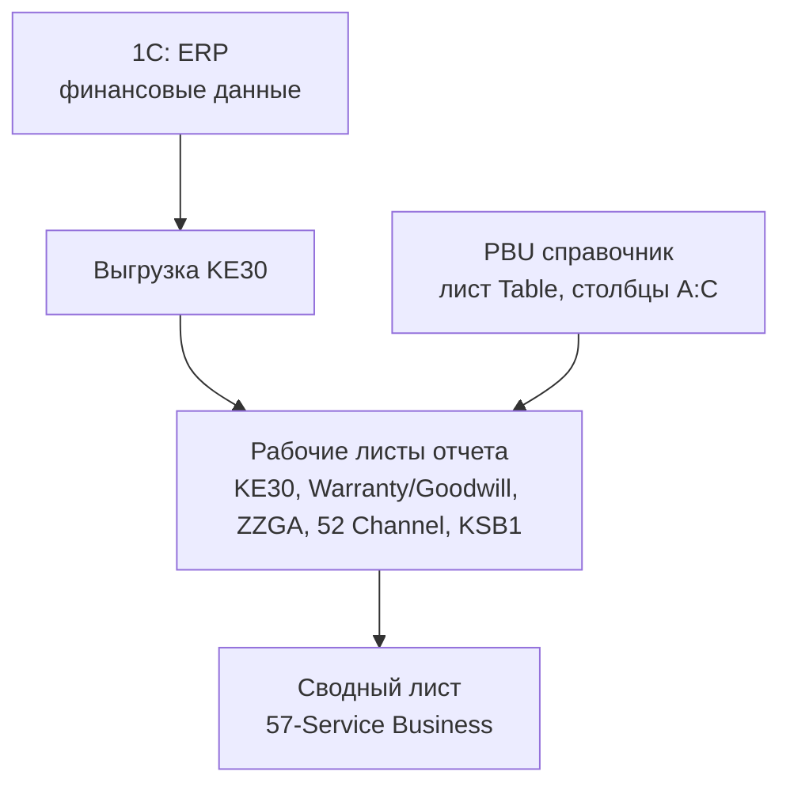

# 57-Service Business - Обзор

Внешний вид отчета 57-Service Business показан на скриншоте: .

Отчет состоит из трех блоков:

1. Выручка, доход, затраты на гарантию и гудвилл по продуктовым группам (PBU).
2. Выручка, доход, затраты на гарантию и гудвилл по сегментам рынка.
3. Service Income Statement - PnL Департамента сервиса.

Выручка от реализации разделяется на три вида: продажи услуг сервиса, продажи запасных частей и продажи готовой продукции. Аналогично распределяются и доход от реализации, и затраты на гарантию, и затраты на гудвилл.

## Поток данных

Первичными данными является отчет KE30 из 1C: ERP; его поля и настройки приведены в следующем пункте.
