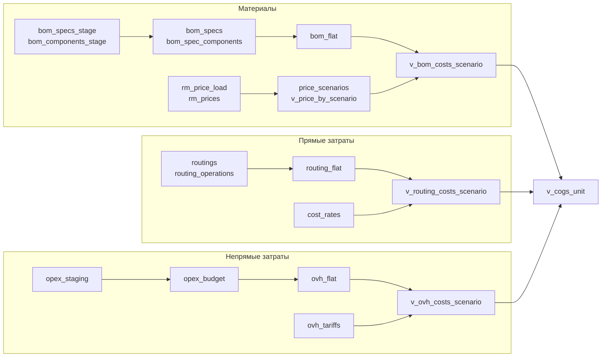

# Архитектура потоков расчёта себестоимости

Этот документ описывает, как данные проходят от загрузочных таблиц staging до витрин `v_*`. Контура разбиты на три блока: материалы, прямые операции и непрямые (overhead). Финальная витрина `v_cogs_unit` собирает результаты всех трёх.

## Глобальный контур
- Excel/CSV загрузчики пишут в staging-таблицы, сохраняя `load_id` и признаки качества.
- Нормализующие процедуры (`upsert_*`, `materialize_*`, миграции в `db/schema.py`) приводят данные к рабочим таблицам.
- Представления `v_bom_costs_scenario`, `v_routing_costs_scenario` и `v_ovh_costs_scenario` дают единый интерфейс для расчётов и попадают в `v_cogs_unit`.

## Материалы (BOM + цены)

**Вход**
- `bom_specs_stage`, `bom_components_stage` — staging после загрузки спецификаций через `loaders.bom_loader`.
- `rm_price_load` — метаданные каждой выгрузки закупочных цен, хранит источник и дату.
- `rm_prices` — нормализованная история цен с привязкой к `load_id`, валюте и артикулу.
- `price_scenarios` — список срезов (BG26, FC3 и т.д.), которые подхватывает `v_price_by_scenario`.

**Преобразования**

| Этап | Таблицы | Суть шага |
|---|---|---|
| Нормализация BOM | `bom_specs`, `bom_spec_components` | `upsert_bom_specs_from_stage` и `upsert_bom_components_from_stage` переносят строки из staging с валидацией. |
| Материализация структуры | `bom`, `bom_flat` | `materialize_bom_flat` строит взвешенный, многоуровневый BOM и пишет плоское дерево `parent → component`. |
| Расчёт потребности | `mo_cost_unit`, `mo_cost_unit_monthly` | SQL из `sql/materialize` агрегирует спецификации с объёмами для бюджетных отчётов. |
| Подготовка цен | `v_price_by_scenario`, `mo_last_price_current` | `ensure_rm_prices` и `ensure_scenario_cost_views` выбирают актуальную цену ≤ `price_scenarios.asof_date` по каждой валюте. |

**Выход**
- `v_bom_costs_scenario` — итоговая витрина «количество × цена» для каждого компонента изделия и сценария.
- Эти данные используются в `calc.mo_materials`, в budget-отчётах и входят в `v_cogs_unit` как компонент `MATCOST`.

## Прямые затраты (операции и ставки)

**Вход**
- `routings`, `routing_operations` — результат загрузки маршрутных карт (`loaders.upsert_routings`), содержит операции, последовательность и департамент.
- `items` — справочник изделий с полями `routing_group` и признаком выпуска.
- `cost_rates` — ставки труда/амортизации/ОПР в разрезе `component_code` (LABOR_DIRECT, OPR_DIRECT, DEPR_DIRECT), периода и сценария, загружаются `loaders.direct_cost_loader`.

**Преобразования**

| Этап | Таблицы | Суть шага |
|---|---|---|
| Построение дерева | `routing_tree`, `routing_nodes` | SQL в `sql/materialize/routing_tree_build.sql` обеспечивает связь `routing_group → операции`. |
| Материализация на изделие | `routing_flat` | `materialize_routing_flat` раскрывает `routing_operations` до уровня `product_id × операция`, рассчитывает `hours_per_unit` и драйверы. |
| Выравнивание ставок | `cost_rates` | Лоадер нормализует Excel в «длинную» форму и поддерживает сценарии, валюту и единицы измерения. |

**Выход**
- `v_routing_costs_scenario` — перемножает `routing_flat.hours_per_unit` на `cost_rates.rate_value`, отдаёт прямые затраты по изделию, операции, департаменту и сценарию.
- Представление используется в калькуляторах (`calc.cost_tree`, `calc.budget`) и даёт компонент `LABOR_DIRECT/OPR_DIRECT/DEPR_DIRECT` в `v_cogs_unit`.

## Непрямые затраты (overhead)

**Вход**
- `opex_staging` — сырые строки бюджета OPEX с признаками ошибок и маппингом на элементы расходов.
- `opex_budget` — нормализованный бюджет после `commit_opex`, привязанный к `elem_id` и году.
- `prod_budget` — объёмы выпуска по сценарию, нужны для расчёта баз распределения.
- `ovh_tariffs` — справочник долей распределения по `overhead_group`, `cost_type`, году и сценарию (формируется через `calc.ovh_rates_calc` или ручной ввод).

**Преобразования**

| Этап | Таблицы | Суть шага |
|---|---|---|
| Построение дерева | `ovh_nodes`, `ovh_tree` | Скрипты в `sql/materialize/ovh_tree_build.sql` выравнивают иерархию центров затрат. |
| Расчёт драйверов | `ovh_flat` | `materialize_ovh_flat` формирует `driver_value_per_unit` по изделиям и группам, подтягивая `prod_budget`, `mo_cost_unit`, `items`. |
| Расширение персонала | `personnel_monthly`, `personnel_yearly` | Используются как источники драйверов для групп с трудовыми базами. |
| Подготовка тарифов | `ovh_tariffs`, `ovh_tariffs_wide_compat` | Миграции приводят доли к tall-формату и дополняют совместимую вьюху. |

**Выход**
- `v_ovh_costs_scenario` — берёт активный год из `active_scenarios`, умножает `ovh_flat.driver_value_per_unit` на доли из `ovh_tariffs` и возвращает накладные расходы по изделиям.
- Дополнительно используется в `calc.ovh_rates_calc` для проверки распределений и входит в `v_cogs_unit` как `OVH_*` компоненты.

## Сценарии и итоговые витрины
- `active_scenarios` хранит текущие пары `vol_scenario`/`price_scenario`; эти значения подхватывают `v_prod_budget_active`, `v_ovh_costs_scenario` и расчёты тарифов.
- `v_cogs_unit` объединяет материалы (`MATCOST`), прямые (`LABOR_DIRECT`, `OPR_DIRECT`, `DEPR_DIRECT`), накладные (`OVH_*`) и дополнительные компоненты из `cost_allocations`.
- Для проверок доступны совместимые вьюхи (`v_ovh_flat_compat`, `mo_last_price_current`) и диагностические SQL в каталоге `sql/materialize`.
